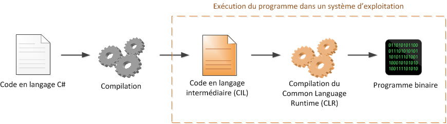
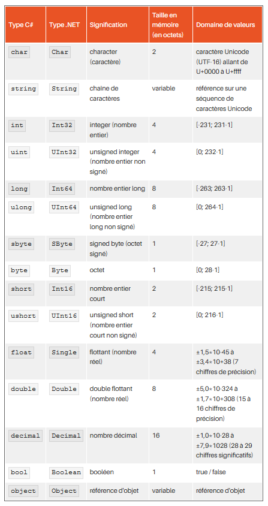

# C# .net

### Liens

* [Cours OpenClassRooms](https://openclassrooms.com/fr/courses/218202-apprenez-a-programmer-en-c-sur-net)
* [Documentation .NET](https://docs.microsoft.com/fr-fr/dotnet/standard/)
* [Documentation c#](https://docs.microsoft.com/fr-fr/dotnet/csharp/tour-of-csharp/)
* [Guide programmation c#](https://docs.microsoft.com/fr-fr/dotnet/csharp/programming-guide/index)
* [Exemple MVVM_Demo Github](https://github.com/MarionChapuis/MVVM_Demo/tree/master)
* [Projet Transports Grenoble](https://github.com/MarionChapuis/TransportsGrenoble)


### Définitions

##### C\#

Language de programmation orienté objet récent (début 2000) inspiré de Java (donc typé) et développé par Microsoft. C'est le langage recommandé pour développer sous Windows. 

##### .NET

C'est le framework ou environnement d'exécution (aussi écrit Dot NET) pour programmer en C# sous Windows : accès réseau, création de fenêtres, appel à une base de données... 

Pour développer sous MacOS ou Linux il faut utiliser .NET Core. 


### Fonctionnement C\#

C# est un langage proche de Java. 
Le framework .NET regroupe un ensemble de bibliothèques pour faciliter le développement. 

La compilation permet de traduire le code en source binaire. Mais la compilation en C# a une particularité. 

La compilation en C# ne donne pas un programme binaire, contrairement au C et au C++. Le code C# est en fait transformé dans un langage intermédiaire (appelé CIL ou MSIL) que l'on peut ensuite distribuer à tout le monde. Ce code, bien sûr, n'est pas exécutable lui-même, car l'ordinateur ne comprend que le binaire.

Le code en langage intermédiaire (CIL) correspond au programme qui sera distribué. Sous Windows, il prend l'apparence d'un .exe comme les programmes habituels, mais il ne contient en revanche pas de binaire.




Lorsqu'on exécute le programme CIL, celui-ci est lu par un autre programme (une machine à analyser les programmes, appelée CLR) qui le compile cette fois en vrai programme binaire.
Le CLR permet également de vérifier le code (sécurité).


### Gestionnaire de packages NuGet 

NuGet est un gestionnaire de packages.


### Paramètrer l'IDE : Visual Studio

Utilisation de l'IDE Visual Studio 2017. 

* Lors du choix du fond de couleurs et du paramètre de développement choisir : "Visual C#"

Quelques raccourcis utiles :

| Raccourcis | Résultats |
| :-------------: |-------------- | 
| ctrl + k et ctrl + c | Commenter 
| ctrl + k et ctrl + u | Décommenter
| ctrl + k et ctrl + d | Indenter 
| prop (puis double tabulation) | Créer une Property
| propfull (puis double tabulation) | Créer une Property et son attribut associé 


### Créer une solution C\# .net 

Dans l'IDE Visual Studio 2017 : 
* Fichier / Nouveau / Projet 
* Chosir 'Application console (.NET Framework)'
* Nommer le projet et choisir l'emplacement 
* Utiliser ensuite le Main


### Variables



* Une **chaîne de caractères** se trouve entre `guillemets ( " )`.
* Un **caractère** se trouve entre des `apostrophes ( ' )`.
```
"Chaîne de caractères" et 'C'
```
* Une variable doit être déclarée en indiquant devant son Type (boolean, integer, string...) et en l'initialisant : 
```c#
String MaVariable = "Caracteres";
```
* En .NET tous les types de variables (String, Int) commence par une majuscule : String, Int, Boolean...


### Enumérations

Comme en Java, il est possible de créer des énumérations qui permettent de regrouper un ensemble de valeurs de type unique. 

*Exemple :*
```c#
enum Jours
{
    Lundi,
    Mardi,
    Mercredi,
    Jeudi,
    Vendredi,
    Samedi,
    Dimanche
}
```
Les énumérations peuvent être appelées par la suite dans le code : 
```c#
Jours monJour = Jours.Vendredi;
```


### Opérateurs

| Opérateur           | Définition        | 
|:-------------------: |:------------------: | 
| <     |plus petit que 
| <=    |plus petit ou égal à
| >     |plus grand que
| >=    |plus grand ou égal à
| ==    |égal à
| !=    |différent de
| &&    |et
| \|\|  |ou


### Tableaux 

Syntaxe : 
```c#
string[] jours = new string[] { "Lundi", "Mardi", "Mercredi", "Jeudi", "Vendredi", "Samedi", "Dimanche" };
Console.WriteLine(jours[3]); // affiche Jeudi
Console.WriteLine(jours[0]); // affiche Lundi
Console.WriteLine(jours[10]); // provoque une erreur d'exécution car l'indice n'existe pas
```

Trier rapidement un tableau : 
```c#
Array.Sort(jours);
```

### Listes

Syntaxe : 
```c#
List<int> chiffres = new List<int>(); // création de la liste
chiffres.Add(8); // chiffres contient 8
chiffres.Add(9); // chiffres contient 8, 9
chiffres.Add(4); // chiffres contient 8, 9, 4

//Récupérer la position d'un élément dans une liste
int indice = jours.IndexOf(4); // indice vaut 2

//Supprimer un élément par sa position dans la liste
chiffres.RemoveAt(1); // chiffres contient 8, 4

//Parcourir une liste
foreach (int chiffre in chiffres)
{
    Console.WriteLine(chiffre);
}
```

### Dictionary 

Les Dictionary fonctionnent avec une "Key" et une "Value" et il ne peut pas y avoir de doublons dans les clés.

##### Déclarer et ajouter dans un Dictionary

Syntaxe : 
```c#
// Création du dictionnaire.
Dictionary<string, string> openWith = new Dictionary<string, string>();

// Ajout de quelques éléments. Il ne peut pas y avoir
// deux clefs identiques mais les valeurs peuvent l'être.
openWith.Add("txt", "notepad.exe");
openWith.Add("bmp", "paint.exe");
openWith.Add("dib", "paint.exe");
openWith.Add("rtf", "wordpad.exe");
```

##### Afficher les données 

Les Dictionary possédent des propriétés utiles : 
* `monDictionnaire.Keys` : collection qui contient les clés du dictionnaire.
* `monDictionnaire.Values` : est une collection qui contient les valeurs du dictionnaire.

Afficher les clés d'un dictionnaire : 
```c#
//Afficher les clés du Dictionary (liste sans doublons)
foreach (String key in listeSansDoublons.Keys)
{
    Console.WriteLine(key);
}
```
Parcourir un Dictionary 
```c#
//Parcourir la lite sans doublons (type Dictionary) pour afficher la paire "key - value"
foreach (KeyValuePair<String, List<String>> kvp in listeSansDoublons)
{
    //Afficher ma clé 
    Console.WriteLine(kvp.Key);

    //Afficher les values (car ma valeur est une Liste)
    foreach (String val in kvp.Value)
    {
        Console.WriteLine(val);
    }
}
```

**Vérifier si le Dictionary contient une clé déjà**
```c#
monDictionnaire.ContainsKey("keyName");
```


### Boucles

#### FOR 

```c#
String[] jours = new String[] { "Lundi", "Mardi", "Mercredi", "Jeudi", "Vendredi", "Samedi", "Dimanche" };

int indice;
for (indice = 0; indice < jours.Length; indice++)
{
    Console.WriteLine(jours[indice]);
}
```

#### FOREACH

```c#
String[] jours = new String[] { "Lundi", "Mardi", "Mercredi", "Jeudi", "Vendredi", "Samedi", "Dimanche" };

foreach (String jour in jours)
{
    Console.WriteLine(jour);
}
```


#### WHILE 

```c#
int i = 0;
while (i < 50)
{
    Console.WriteLine("Bonjour C#");
    i++;
}
```

#### DO WHILE 

```c#
int i = 0;
do
{
    Console.WriteLine("Bonjour C#");
    i++;
}
while (i < 50);
```

#### Les instructions : BREAK - CONTINUE

Il est possible de sortir prématurément d’une boucle grâce à l’instruction break. Dès qu’elle est rencontrée, elle sort du bloc de code de la boucle. L’exécution du programme continue alors avec les instructions situées après la boucle. Par exemple : 

```c#
int i = 0;
while (true)
{
    if (i >= 50)
    {
        break;
    }
    Console.WriteLine("Bonjour C#");
    i++;
}
```

Il est également possible de passer à l’itération suivante d’une boucle grâce à l’utilisation du mot-clé continue. Exemple :
```c#
for (int i = 0; i < 20; i++)
{
    if (i % 2 == 0)
    {
        continue;
    }
    Console.WriteLine(i);
}
//L'exemple n'affichera que les chiffres impairs car s'il tombe sur un chiffre paire il passera à l'itération suivante et donc n'affichera pas le chiffre pair.
```


### Le Main 

Point d'entrée d'un programme exécutable (c'est l'endroit où le contrôler du programme commence et se termine).
```c#
using System;
using System.Collections.Generic;
using System.Linq;
using System.Text;
using System.Threading.Tasks;

namespace Helloworld
{
    class Program
    {
        static void Main(string[] args)
        {
            System.Console.WriteLine(message.GetHelloMessage());           
        }
    }
}
```


### Propriétés

[Doc Propriétés](https://docs.microsoft.com/fr-fr/dotnet/csharp/programming-guide/classes-and-structs/properties)

Hybride entre attribut et méthode possédant des getters et setters. Il est possible de rendre le setter en visibilité 'private'.

Les propriétés permettent à une classe d'exposer un moyen public d'obtenir et de définir des valeurs, tout en masquant le code d'implémentation ou de vérification.

Dans les setters, le mot clé "value" correspond à ce que l'utilisateur entrera en paramètre du setter comme nouvelle valeur pour l'attribut. 


*Exemple* :
```c#
using System;

public class Person
{
   private string firstName;
   private string lastName;
   
   public Person(string first, string last)
   {
      firstName = first;
      lastName = last;
   }

   //Exemple d'une propriété
   public string Name => $"{firstName} {lastName}";   

   //Autre exemple d'une propriété
   public String Name
   {
        get => name;
        set => name = value;
   }
}

public class Example
{
   public static void Main()
   {
      var person = new Person("Camille", "Onette"); 
      Console.WriteLine(person.Name);
      // résultat "Camille Onette"
   }
}
```

*Exemple* : 
La méthode GetHelloMessage peut être une propriété 

```c#
using System;
using System.Collections.Generic;
using System.Linq;
using System.Text;
using System.Threading.Tasks;

namespace Helloworld
{
    public class Message
    {
        //Attributs déterminant les différentes tranches horaires
        protected int matin = 9;
        protected int midi = 13;
        protected int soir = 18;

        //Propriété GetHelloMessage
        public String GetHelloMessage
        {
            get
            {
                //Récupérer la date actuelle
                DateTime date = DateTime.Now;
                //date = new DateTime(2018, 08, 20, 8, 52, 12);
                String message = "";
                //Pour la tranche vendredi soir au lundi matin
                if (date.DayOfWeek == DayOfWeek.Friday && date.Hour >= this.soir || date.DayOfWeek == DayOfWeek.Saturday || date.DayOfWeek == DayOfWeek.Sunday || date.DayOfWeek == DayOfWeek.Monday && date.Hour < this.matin)
                {
                    message = "Bon week-end";
                }
                else if (date.Hour >= this.soir || date.Hour < this.matin)
                {
                    //Tranche "semaine" pour le soir
                    message = "Bonsoir";
                }
                else if (date.Hour < this.midi)
                {
                    //Tranche "semaine" pour le matin
                    message = "Bonjour";
                }
                else
                {
                    //Tranche "semaine" pour l'après-midi
                    message = "Bon après-midi";
                }

                //Message complet  
                String messageComplet = message + " " + Environment.UserName;
                return messageComplet;
            }
        }

        //Constructeur prenant en paramètres les différentes tranches horaires
        public Message (int matin, int midi, int soir)
        {
            this.matin = matin;
            this.midi = midi;
            this.soir = soir;
        }

    }
}
```

### Quelques commandes 

| Syntaxe | Action | Exemple |
|:--------:|-------|---------|
| System.Console.WriteLine("") | Ecrire dans la console | System.Console.WriteLine("Chaîne caractères" + maVariable);
| System.Console.ReadLine() | Récupérer l'entrée utilisateur | String saisie = System.Console.ReadLine();


### Interface

Pour créer rapidement une interface à partir de la classe qui l'implémentera : 
* Dans la classe se positionner sur le nom de la classe et cliquer sur le tournevis (tout à gauche)
* Choisir "Extraire l'interface" 

Résultat : 
* l'interface sera créée ainsi que la ou les méthode(s) qui étaient dans la classe
* dans la classe il y aura déjà la syntaxe pour l'implémentation de l'interface


### Stocker des ressources 

Il est possible de stocker des ressources, comme par exemple des données JSON, dans une classe spécifique et pouvoir ensuite faire appel à cette classe.

* Créer une nouvelle Classe de type "Fichier de ressources" : "Resource.resx"
* Renseigner un nom pour la variable
* Copier tel quel le JSON (provenant d'une API par exemple)
* Pour l'utiliser dans une classe 
```c#
NomResource.maVariable;
```


### Tests Unitaires 

Créer un test unitaire : se positionner dans la classe, faire clic droit et sélectionner "Créer des tests unitaires".

**Attention : la classe doit être "public"**

Lorsqu'on test une classe elle est très souvent liée à d'autres classes ou d'autres éléments externes (lien avec une API). 
Pour pouvoir maîtriser les éléments externes à la classe, nous avons besoind de l'injection de dépendance. 


### Injections de dépendances et doublure de tests

L'injection de dépendance permet d'isoler les éléments externes à la classe pour pouvoir les gérer. 

La doublure de tests fait suite à l'injection de dépendance et permet d'utiliser des interfaces pour créer de "faux" objets pour simuler une dépendance lors des tests unitaires. 

Ces objets doubles sont classés en plusieurs catégories selon leur degré d'intelligence et selon la manière donc ils vont imiser le comportement de la classe remplacée.

Dans l'exemple ci-dessous, ces objets seront utilisés dans la classe FakeTime qui implémente l'interface ITime. Ils permettront d'implémenter la propriété "Date" de l'interface. 


#### Dummy

Il s'agit du plus simple (niveau degré d'intelligence), c'est une classe dont on se fiche comment elle est utilisée. 

Le Dummy est juste là pour implémenter l'interface sans logique spécifique. 

Dans l'exemple ci-dessous, le dummy correspondrait à un simple "new DateTime()" dans la classe "FakeTime" : 
```c#
namespace HelloworldTests
{
    public class FakeTime : ITime
    {
        public DateTime Date
        {
            get
            {
                return new DateTime();
            }
        }
    }
}
```

#### Stub

Alors pour les stubs, il s’agit d’implémenter une classe qui va répondre exactement ce que j’attends.

Dans l'exemple ci-dessous, dans la classe "FakeTime", le stub correspond à une date précise "new DateTime(2018,08,20,15,12,11)" : 
```c#
namespace HelloworldTests
{
    public class FakeTime : ITime
    {
        public DateTime Date
        {
            get
            {
                return new DateTime(2018,08,20,15,12,11);
            }
        }
    }
}
```

#### Fake

Le Fake permet d'implémenter la classe comme on le souhaite.

Dans l'exemple ci-dessous, dans la classe "FakeTime", le fake permet de retourner une propriété qui sera ensuite modifié comme on le souhaite dans les tests (on pourra choisir la date que l'on souhaite).

```c#
namespace HelloworldTests
{
    public class FakeTime : ITime
    {
        //Créer une propriété qui sera retourné dans le getter de Date
        public DateTime DateToReturn { get; set; }

        public DateTime Date
        {
            get
            {
                return DateToReturn;
            }
        }
    }
}
```


#### Spy

Le Spy fonctionne comme un Stub mais en enregistrant les informations pendant le test que l'on pourra aller chercher ensuite.

Le Spy peut être très utile pour savoir combien de fois une méthode a été appelée ou savoir pourquoi le test échou.


#### Mock

Le Mock est un objet qui est une substitution complète de l'implémentation originale d'une classe concrète.

Le Mock a le même but que le Fake mais permet de ne plus écrire la classe qui remplace l'originale. Le mock utilise des librairies qui vont permettre de générer dynamiquement l'objet de doublure dans le corps du code de tests. 

Il existe 2 références de librairies : 
* NMock3 : simple mais malheureusement plus maintenu
* Moq : mêmes fonctionnalités mais avec une syntaxe moins évidente

Ces librairies s'ajoutent via les packages NuGet. 


#### Exemple avec un Fake : implémenter une propriété  

*Exemple :* Avoir une fonction GetHelloMessage dans Message qui retourne un message selon l'heure et le jour. 

Le problème est que dans cette fonction, on initialise une date à la date actuelle. Cela empêche de pouvoir tester le code avec des tests unitaires. 

Solution :  

* Créer une interface pour isoler la dépendance : 
    * **Super astuce** : Voir la super astuce dans "Interface" pour créer une interface rapidement
    * nom du fichier : ITime.cs dans le projet "Helloworld"
    * contient une propriété "Date" de type DateTime : 
    ```c#
    using System;
    using System.Collections.Generic;
    using System.Linq;
    using System.Text;
    using System.Threading.Tasks;

    namespace Helloworld
    {
        public interface ITime
        {
            DateTime Date { get; }
        }
    }
    ```
* Dans la classe Message :
    * ajouter un attribut du type de l'interface "ITime \_time"
    * Utiliser l'attribut dans la méthode 'GetHelloMessage' : \_time.Date.DayOfWeek pour la date du jour par exemple
```c#
namespace Helloworld
{
    public class Message
    {
        //Attributs déterminant les différentes tranches horaires
        protected int matin = 9;
        protected int midi = 13;
        protected int soir = 18;
        private ITime _time;

         public String GetHelloMessage()
        {
            //date = new DateTime(2018, 08, 20, 8, 52, 12);
            String message = "";
            //Pour la tranche vendredi soir au lundi matin
            if (_time.Date.DayOfWeek == DayOfWeek.Friday && _time.Date.Hour >= this.soir || _time.Date.DayOfWeek == DayOfWeek.Saturday || _time.Date.DayOfWeek == DayOfWeek.Sunday || _time.Date.DayOfWeek == DayOfWeek.Monday && _time.Date.Hour < this.matin)
            {
                message = "Bon week-end";
            }
            //...
        }
    }
}
```
* Créer une classe concrète pour impléter l'interface ITime permettant ainsi de donner la date actuelle :
    * nom fichier : Time.cs dans projet 'Helloworld'
    * Pour dire que la classe implémente une interface : 'public class MaClasse : MonInterface'
    * Implémenter "Date" en complémentant le getter : 
    ```c#
    using System;
    using System.Collections.Generic;
    using System.Linq;
    using System.Text;
    using System.Threading.Tasks;

    namespace Helloworld
    {
        public class Time : ITime
        {
            public DateTime Date
            {
                get
                {
                    return DateTime.Now;
                }
            }
        }
    }
    ```
* Dans la classe Message, ajouter dans le constructeur l'initialisation de l'attribut ITime \_time : 

**A ce niveau, nous avons isolé la dépendance et le code fonctionne correctement. Maintenant, pour réaliser les tests unitaires, il faut injecter les dépendances.**

* Dans la classe Message 
    * ajouter un constructeur contenant un paramètre supplémentaire qui sera la Date souhaitée de type ITime 
    * Initialiser l'attribut \_time avec le nouveau paramètre 
    * A la place de "public" mettre "internal" pour la visibilité du constructeur, cela empêchera le client d'utiliser ce constructeur réservé aux tests unitaires
    * Pour pouvoir utiliser ce nouveau constructeur, ajouter dans le fichier "AssemblyInfo.cs" (projet Helloworld), à la fin la ligne : 
    ```c#
    [assembly: InternalsVisibleTo("HelloworldTests")]
    ```
    * Nouveau constructeur dans la classe Message : 
    ```c#
    //Constructeur pour les tests unitaires 
    internal Message(ITime time, int matin, int midi, int soir)
    {
        this.matin = matin;
        this.midi = midi;
        this.soir = soir;
        _time = time;
    }
    ```
* Créer un Fake pour pouvoir implémenter l'interface ITime avec les données que l'on souhaite :
    * Créer dans le projet test "HelloworldTests" un dossier "Fakes" et ajouter une classe "FakeTime"
    * Cette classe FakeTime implémente l'interface ITime 
    * Ajouter une propriété avec une visibilité public "DateTime DateToReturn {get;set;}"
    * Implémenter Date (qui est dans l'interface) en complétant le getter avec un return de la propriété DateToReturn
    ```c#
    using Helloworld;
    using System;
    using System.Collections.Generic;
    using System.Linq;
    using System.Text;
    using System.Threading.Tasks;

    namespace HelloworldTests
    {
        public class FakeTime : ITime
        {
            public DateTime DateToReturn { get; set; }

            public DateTime Date
            {
                get
                {
                    return DateToReturn;
                }
            }
        }
    }
    ``` 

* Dans la classe Test "MessageTests.cs", créer un test pour chaque message que l'on souhaite tester. Dans un test : 
    * Créer une instance de FakeTime pour générer une date précise 
    * Attribuer à la propriété DateToReturn (de la classe FakeTime) la valeur de la date souhaitée
    * Instancier un objet Message (classe que l'on souhaite tester)
    * Stocker le résultat de la méthode que l'on test "GetHelloMessage" dans une variable
    * Comparer cette variable au résultat que l'on attend (message "bonjour" par exemple pour le matin en semaine)
    ```c#
    using Microsoft.VisualStudio.TestTools.UnitTesting;
    using Helloworld;
    using System;
    using System.Collections.Generic;
    using System.Linq;
    using System.Text;
    using System.Threading.Tasks;
    using HelloworldTests;

    namespace Helloworld.Tests
    {
        [TestClass()]
        public class MessageTests
        {
            [TestMethod()]
            public void MessageTest()
            {
                //Retourner un échec du test
                //Assert.Fail();
            }

            //Tester que le message retourne "Bonjour" le matin
            [TestMethod()]
            public void GetHelloMessageTest_Bonjour()
            {
                //Créer une instance de FakeTime pour générer une date précise
                FakeTime fake = new FakeTime();
                fake.DateToReturn = new DateTime(2018, 08, 21, 9, 0, 0);
                //Créer une instance de l'objet Message avec la date que je souhaite
                Message message = new Message(fake, 9, 13, 18);
                //Stocker le résultat de l'appel à la méthode que je test
                String resultat = message.GetHelloMessage();
                //Je m'attends à avoir le résultat suivant 
                StringAssert.Contains(resultat, "Bonjour");
            }
        }
    }
    ```

**Refactor du constructeur de la classe Message** 
* Pour le constructeur classique étant utilisé pour le programme, indiquer qu'il utilise le constructeur pour les tests avec comme paramètre "date" une instance de la classe "Time" (classe générant la date actuelle)
* ":this" (à positionner avant les crochets) indique qu'on utilise l'autre constructeur
```c#
//Constructeur prenant en paramètres les différentes tranches horaires
public Message(int matin, int midi, int soir)
    :this (new Time(), matin, midi, soir)
{
}

//Constructeur pour les tests unitaires 
internal Message(ITime time, int matin, int midi, int soir)
{
    this.matin = matin;
    this.midi = midi;
    this.soir = soir;
    _time = time;
}
```

#### Exemple avec un Fake : implémenter une méthode 

*Exemple :* Avoir une fonction `GetDetailsLigne` dans la classe DataTypeTransport qui retourne les détails sur une ligne (appel API métromobilité). 

Le problème est que dans cette fonction, on se connecte à une API pour obtenir les données. Il faut donc isoler cette dépendance, pour pouvoir tester la méthode, même lorsque l'API ne fonctionne pas. 

L'idée est qu'on utilise une classe `ConnectApi` avec une méthode `ConnexionApi` qui permet de se connecter à une API et de retourner le résultat au format JSON. 

Le principe est donc de créer une classe "Fake" qui retourne simplement un résultat JSON pour ensuite pouvoir tester notre méthode `GetDetailsLigne`.

Solution :  

* Créer une interface pour isoler la dépendance : 
    * **Super astuce** : Voir la super astuce dans "Interface" pour créer une interface rapidement
    * nom du fichier : IConnectApi.cs dans le projet "TransportLibrary"
    * contient une méthode `ConnexionApi` (comme dans la classe concrète `ConnectApi`)
    * interface IConnectApi.cs :  
```c#
using System;

namespace TransportLibrary
{
    public interface IConnectApi
    {
        String ConnexionApi(String url);
    }
}
```
* Avoir une classe concrète `ConnectApi` implémentant l'interface et permettant la connexion à l'API 
* Dans la classe `DataTypeTransport` :
    * Ajouter un attribut du type de l'interface
    * Se servir de l'attribut pour appeler la méthode de connexion : monAttribut.ConnexionApi();
    * Ajouter un constructeur permettant d'initialiser l'attribut 
    * Classe `DataTypeTransport`
```c#
using Newtonsoft.Json;
using System;
using System.Collections.Generic;
using System.Linq;
using System.Text;
using System.Threading.Tasks;

namespace TransportLibrary
{
    public class DataTypeTransport
    {
        //Attribut du type de l'interface
        private IConnectApi connect;

        //Obtenir les détails d'une ligne
        public TypeTransport GetDetailsLigne(String idLigne)
        {
            String url = "http://data.metromobilite.fr/api/routers/default/index/routes?codes=" + idLigne;
            //Appeler la méthode de connexion en passant par l'attribut 'connect'
            String responseFromServer = this.connect.ConnexionApi(url);
            List<TypeTransport> listDetailsLigne = JsonConvert.DeserializeObject<List<TypeTransport>>(responseFromServer);
            return listDetailsLigne[0];
        }

        //Constructeur initialisant l'attribut connect
        public DataTypeTransport(IConnectApi connect)
        {
            this.connect = connect;
        }
    }
}
```
* Dans le fichier "Program.cs" corriger le code pour que le programme fonctionne toujours en ajoutant un paramètre lors de l'instanciation de la classe `DataTypeTransport`
```c#
using Newtonsoft.Json;
using System;
using System.Collections.Generic;
using System.Data;
using System.IO;
using System.Linq;
using System.Net;
using System.Text;
using System.Threading.Tasks;
using TransportLibrary;

namespace TransportsGrenoble
{
    class Program
    {
        static void Main(string[] args)
        {
            //...//
            //Parcourir la lite sans doublons (type Dictionary) pour afficher la paire "key - value"
            foreach (KeyValuePair<String, List<String>> kvp in listeSansDoublons)
            {
                Console.WriteLine("******* " + kvp.Key + " *******");
                foreach (String idLigne in kvp.Value)
                {
                    //Instancier DataTypeTransport avec en paramètre la vraie connexion à l'API
                    DataTypeTransport dataTypeTransport = new DataTypeTransport(new ConnectApi());
                    TypeTransport detailsLigne = dataTypeTransport.GetDetailsLigne(idLigne);
                    Console.WriteLine(detailsLigne.mode + " - " + detailsLigne.shortName + " : " + detailsLigne.longName);
                }
            }
        }
    }
}
```
* Créer la classe Fake : `FakeConnectApi.cs`
    * Créer un dossier "Fakes" dans le projet de test `TransportLibraryTest`
    * Créer la classe `FakeConnectApi.cs` dans le dossier Fakes
    * Implémenter la méthode `ConnexionApi` pour qu'elle retourne un JSON spécifique (étant la vraie réponse de l'appel à l'API)
    * Créer un attribut qui sera retourné par la méthode et plus tard lors des tests nous initialiserons cet attribut
    * Classe FakeConnectApi.cs
```c#
using System;
using System.Collections.Generic;
using System.Linq;
using System.Text;
using System.Threading.Tasks;
using TransportLibrary;

namespace TransportLibraryTests.Fakes
{
    class FakeConnectApi : IConnectApi
    {
        public String resultatJson { get; set; }

        public String ConnexionApi(String url)
        {
            return resultatJson;
        }
    }
}
```
* Utiliser une classe de type `Fichier de Ressources` pour stocker le JSON (voir dans le mémo un peu plus haut)
* Créer la classe de test 
    * Instancier une FakeConnectApi 
    * Initialiser la valeur de l'attribut en lui donnant celle de la ressource 
    * Instancier la classe que l'on test DataTypeTransport avec en paramètre l'instance de la fausse connexion 
    * Comparer les résultat avec des `Assert` pour tester le résultat
```c#
using Microsoft.VisualStudio.TestTools.UnitTesting;
using TransportLibrary;
using System;
using System.Collections.Generic;
using System.Linq;
using System.Text;
using System.Threading.Tasks;
using TransportLibraryTests.Fakes;
using TransportLibraryTests;

namespace TransportLibrary.Tests
{
    [TestClass()]
    public class DataTypeTransportTests
    {
        [TestMethod()]
        public void GetDetailsLigneTest()
        {
            FakeConnectApi fake = new FakeConnectApi();
            fake.resultatJson = Resource.detailLigne12;
            DataTypeTransport dataTypeTransport = new DataTypeTransport(fake);
            TypeTransport resultat = dataTypeTransport.GetDetailsLigne("SEM:12");
            Assert.AreEqual(resultat.shortName, "12");
            Assert.AreEqual(resultat.longName, "Eybens Maisons Neuves / Saint-Martin-d'Hères Les Alloves");
            Assert.AreEqual(resultat.color, "009930");
            Assert.AreEqual(resultat.mode, "BUS");
            Assert.AreEqual(resultat.type, "PROXIMO");
        }
    }
}
``` 
* Lancer les tests (Test/Executer/Tous les tests) et prier pour voir du vert


### Travailler avec une API 

#### Se connecter à l'API  

La première ligne est importante pour éviter les erreurs de communication. Elle doit être placée en première dans le programme.

*Exemple : liste des lignes de transport à proximité d'un point*
```c#
using System;
using System.Collections.Generic;
using System.IO;
using System.Linq;
using System.Net;
using System.Text;
using System.Threading.Tasks;

namespace TransportsGrenoble
{
    class Program
    {
        static void Main(string[] args)
        {
            //Permet d'éviter les erreurs de communication avec l'API 
            ServicePointManager.SecurityProtocol = SecurityProtocolType.Tls12 | SecurityProtocolType.Tls11 | SecurityProtocolType.Tls;

            Console.WriteLine("Transports à pied c'est mieux de Grenoble");

            //Définir les éléments : latitude, longitude et distance  pour ensuite faire appel à l'API
            String latitude = "45.185476";
            String longitude = "5.727772";
            //Int32 est important pour fonctionner en .NET
            Int32 distance = 500; //périmètre de recherche

            //Créer une connexion à l'API
            WebRequest request = WebRequest.Create("http://data.metromobilite.fr/api/linesNear/json?x="+longitude+ "&y="+latitude+ "&dist=" + distance + "&details=true");
            //Récupérer la réponse de la connexion à l'API
            WebResponse response = request.GetResponse();
            //Afficher le status de la réponse pour la connexion à l'API 
            Console.WriteLine(((HttpWebResponse)response).StatusDescription);
            // Obtenir le flux contenant les données de réponse envoyées par le serveur 
            Stream dataStream = response.GetResponseStream();
            // Ouvrir le flux de données avec le StreamReader pour faciliter la lecture  
            StreamReader reader = new StreamReader(dataStream);
            // Lire le contenu
            string responseFromServer = reader.ReadToEnd();
            // Afficher le contenu
            Console.WriteLine(responseFromServer);
            // Fermer les différentes connexions  
            reader.Close();
            dataStream.Close();
            response.Close();
        }
    }
}
```


#### Convertir les données JSON en c\#

Avec le gestionnaire de packages NuGet, il faut installer "Newtonsoft.Json" pour pouvoir transformer les données JSON en objets C#. 

Nom du package : "Newtonsoft.Json" à installer avec NuGet.

Etapes :
* Télécharger le package 
* Créer une classe qui a les mêmes propriétés que les données JSON. Pour cela, utiliser [ce traducteur](http://json2csharp.com) pour transformer les données JSON en classe C#
```c#
using System;
using System.Collections.Generic;
using System.Linq;
using System.Text;
using System.Threading.Tasks;

namespace TransportLibrary
{
    public class Ligne
    {
        public string id { get; set; }
        public string name { get; set; }
        public double lon { get; set; }
        public double lat { get; set; }
        public List<string> lines { get; set; }
    }
}
```
* Stocker dans une liste (si nécessaire) du type de la classe les données récupérées de l'API 
```c#
// (Voir plus haut les éléments précédents) 
//Lire le contenu
string responseFromServer = reader.ReadToEnd();
//Stocker dans une liste d'objets Ligne l'ensemble des informations au format JSON pour les convertir en objet c#
List <Ligne> listeArrets = JsonConvert.DeserializeObject<List<Ligne>>(responseFromServer);
```
* Afficher les données de la liste 
```c#
//Boucler sur la liste d'objets de type Ligne
foreach (Ligne arret in listeArrets)
{
    //un arret contient une liste de lignes : arret.lines (d'où le 2ème foreach)
    foreach (String ligne in arret.lines)
    {
        //Avoir uniquement le numéro de ligne sans le "SEM:"
        int delimiter = ligne.IndexOf(":");
        Console.WriteLine("Id : "+ arret.id+ " Arret : " + arret.name + " - ligne " + ligne.Substring(delimiter + 1));
    }
}
```


### Créer une librairie (.dll)

La librairie est un nouveau projet de type "Librairie" permettant d'avoir des classes qui seront utilisées pour les projets à venir (ex : traitement des données d'une API).

Il faut créer un projet "Librairie" dans notre solution et ajouter les classes nécessaires.

Ces classes contiendront, par exemple, toutes les méthodes nécessaires pour effectuer les requêtes et de récolter les données provenant d'une API.

##### Mise en place d'une librairie 

*Exemple* : Projet Transports en Commun, avoir un programme qui affiche à partir d'une localisation, l'ensemble des arrêts à proximité avec les lignes disponibles à ces arrêts. 


* Créer un projet "Class Library" (ou "Bibliothèque de classes (.NET Framework)")
* Nommer ce nouveau projet : par exemple "TransportLibrary"
* Une classe "Class1.cs" est déjà créée, elle peut donc servir de première classe 

Le principe est de faire :
* une classe généraliste avec une méthode pour se connecter à l'API et récupérer les données
* une classe pour traiter les données (chaque URL de l'API aura sa classe puisque les données traitées ne seront pas les mêmes)

Concernant l'exemple, en l'état, la solution contient :
* un projet de type "Console" : contient uniquement la classe principale "Program.cs"
* un projet de type "Librairie" qui contient l'ensemble des classes (y compris la classe "Ligne" par exemple)


**Recupérer les arrêts à proximité d'un point et les lignes qui sont liées à ces arrêts**
* Classe Ligne.cs 
```c#
using System;
using System.Collections.Generic;
using System.Linq;
using System.Text;
using System.Threading.Tasks;

namespace TransportLibrary
{
    public class Ligne
    {
        public string id { get; set; }
        public string name { get; set; }
        public double lon { get; set; }
        public double lat { get; set; }
        public List<string> lines { get; set; }
    }
}
```
* Classe ConnectApi.cs (classe généraliste permettant la connexion à une API)
```c#
using System;
using System.Collections.Generic;
using System.IO;
using System.Linq;
using System.Net;
using System.Text;
using System.Threading.Tasks;

namespace TransportLibrary
{
    public class ConnectApi
    {
        //Méthode pour se connecter à l'API et renvoyer les données 
        public String ConnexionApi(String url)
        {
            //Permet d'éviter les erreurs de communication avec l'API 
            ServicePointManager.SecurityProtocol = SecurityProtocolType.Tls12 | SecurityProtocolType.Tls11 | SecurityProtocolType.Tls;
            //Créer une connexion à l'API
            WebRequest request = WebRequest.Create(url);
            //Récupérer la réponse de la connexion à l'API
            WebResponse response = request.GetResponse();
            //Afficher le status de la réponse pour la connexion à l'API 
            //Console.WriteLine(((HttpWebResponse)response).StatusDescription);
            // Obtenir le flux contenant les données de réponse envoyées par le serveur 
            Stream dataStream = response.GetResponseStream();
            // Ouvrir le flux de données avec le StreamReader pour faciliter la lecture  
            StreamReader reader = new StreamReader(dataStream);
            // Lire le contenu
            String responseFromServer = reader.ReadToEnd();
            // Fermer les différentes connexions  
            reader.Close();
            dataStream.Close();
            response.Close();
            //Retourner les données
            return responseFromServer;
        }

    }
}
```
* Classe DataLignesProximite.cs
```c#
using Newtonsoft.Json;
using System;
using System.Collections.Generic;
using System.Linq;
using System.Text;
using System.Threading.Tasks;

namespace TransportLibrary
{
    public class DataLignesProximite
    {
        //Récupérer une liste de type Ligne 
        private List<Ligne> GetDataLignesProximite(String latitude, String longitude, Int32 distance)
        {
            ConnectApi connexion = new ConnectApi();
            String url = "http://data.metromobilite.fr/api/linesNear/json?x=" + longitude + "&y=" + latitude + "&dist=" + distance + "&details=true";
            String responseFromServer = connexion.ConnexionApi(url);
            //Stocker dans une liste d'objets Ligne l'ensemble des informations au format JSON pour les convertir en objet c#
            List<Ligne> listeArrets = JsonConvert.DeserializeObject<List<Ligne>>(responseFromServer);
            return listeArrets;
        }

        //Supprimer les doublons dans les arrets et lignes 
        public Dictionary<String, List<String>> GetDataLignesProximiteSansDoublons (String latitude, String longitude, Int32 distance)
        {
            List<Ligne> listeArrets = GetDataLignesProximite(latitude, longitude, distance);
            //Liste sans doublons : Créer un objet de type Dictionary contenant comme Key : Arret et Value : listeLignes
            Dictionary<String, List<String>> listeSansDoublons = new Dictionary<string, List<String>>();
            //Boucler sur les données pour créer un Dictionary(NomArret, Lignes)
            foreach (Ligne arret in listeArrets)
            {
                if (!listeSansDoublons.ContainsKey(arret.name))
                {
                    //Ajouter dans la liste sans doublons la paire "Key : nom arret, value : listeLignes" 
                    listeSansDoublons.Add(arret.name, arret.lines);
                }
                //Mon arret est déjà dans la liste, je vais donc vérifier que toutes les lignes de l'arrêt sont déjà dans la liste de cet arret
                else
                {
                    //Boucler sur les lignes de l'arrêt
                    foreach (String ligne in arret.lines)
                    {
                        //Si la ligne n'est pas déjà dans la liste des lignes de l'arret dans le Dictionary (liste sans doublons)
                        if (!listeSansDoublons[arret.name].Contains(ligne))
                        {
                            //J'ajoute maligne dans le "Value" de mon arrêt à la liste des lignes
                            listeSansDoublons[arret.name].Add(ligne);
                        }
                    }
                }
            }
            return listeSansDoublons;
        }
    }
}
```
* Program.cs (Dans le projet Console)
```c#
using Newtonsoft.Json;
using System;
using System.Collections.Generic;
using System.Data;
using System.IO;
using System.Linq;
using System.Net;
using System.Text;
using System.Threading.Tasks;
using TransportLibrary;

namespace TransportsGrenoble
{
    class Program
    {
        static void Main(string[] args)
        {
            //Définir les éléments : latitude, longitude et distance  pour ensuite faire appel à l'API
            String latitude = "45.185476";
            String longitude = "5.727772";
            Int32 distance = 500; //périmètre de recherche
            //Instance pour traitement des données
            DataLignesProximite dataLignesProximite = new DataLignesProximite();
            //Récupérer les lignes et arrêts sans doublons à proximité
            Dictionary<String, List<String>> listeSansDoublons = dataLignesProximite.GetDataLignesProximiteSansDoublons(latitude, longitude, distance);
            //Foreach pour afficher les données...
        }
    }
}
```

**A noter: les classes qui ne seront pas utilisées dans le Program.cs doivent être en "private"**


### Générer la librairie 

Une librairie peut être utilisée depuis un autre projet. Il faut donc générer un fichier .dll qui pour être utilisé depuis un autre projet.

* Dans Visual Studio, dans le petit menu déroulant "Gestionnaire de configurations" choisir "Release" au lieu de "Debug"
* Générer / Générer NomLibrairie (MAJ+F6) 
* Les fichiers sont créés dans NomLibrairie/bin/release/


## Application MVVM 

[Ressource présentation MVVM](https://blogs.msdn.microsoft.com/msgulfcommunity/2013/03/13/understanding-the-basics-of-mvvm-design-pattern/)
[Petit exemple dans la doc](https://docs.microsoft.com/fr-fr/dotnet/framework/wpf/getting-started/walkthrough-my-first-wpf-desktop-application)
[Autre petit exemple]()


Le design pattern MVVM : 
* Model (données)
* View (la vue)
* ViewModel (l'interface permettant de transmettre les données à la vue)

Une application MVVM s'appuie sur l'utilisation de WPF pour l'interface graphique.


### Créer un projet WPF 

WPF (Windows Presentation Foundation) dernière approche de Windows en terme de framework GUI (Graphical User Interface).

Fonctionne avec le XAML (eXtensible Application Markup Language - Langage extensible de description d'application). Fonctionne comme avec HTML.  

* Fichier / Nouveau Projet
* Dans "Visual C# / Windows Desktop" et choisir `Application WPF (.NET Framework)`
* Nommer le projet et choisir le dossier d'emplacement 

Il faut également créer 3 dossiers pour ordonner les classes :
* Model
* ViewModel
* Views 

L'exemple utilisé dans le mémo est disponible sur GitHub : [MVVM_Demo](https://github.com/MarionChapuis/MVVM_Demo/tree/master)

**Définir le projet Interface Graphique comme projet de démarrage**. 

Si notre solution comporte également un projet console, lorsqu'on lance avec CTRL + F5 le programme, c'est le projet console qui s'affiche.

Pour modifier cela et afficher notre interface graphique, il faut :
* se positionner sur le projet de l'interface graphique 
* Click droit
* Choisir "Définir comme projet de démarrage"


### Structure WPF

* `App.xaml` : Définit une application WPF et les ressources. Se servir de ce fichier pour spécifier l'interface utilisateur qui s'affiche automatiquement quand l'application s'ouvre (StartupUri).
```c#
<Application x:Class="ExpenseIt.App"
     xmlns="http://schemas.microsoft.com/winfx/2006/xaml/presentation"
     xmlns:x="http://schemas.microsoft.com/winfx/2006/xaml"
     StartupUri="MainWindow.xaml">
    <Application.Resources>
         
    </Application.Resources>
</Application>
```
* `MainWindow.xaml` : Fenêtre principale de l'application qui affiche le contenu créé dans les pages. Le `Window` définit les propriétés d'une fenêtre (titre, taille, icône, évènements...).
* `MainWindow.xaml.cs` : Ce fichier est un fichier code-behind qui contient le code pour gérer les événements déclarés dans MainWindow.xaml. Cette classe est `partial` car lors de la compilation, le code dans la Window sera compilé et traduit en C# pour créer une classe complète.

Une fenêtre WPF est la combinaison d'un fichier XAML (.xaml), dans lequel l'élément <Window> est la racine, et un fichier de CodeBehind (littéralement "code derrière") (.cs).


### Boîte à outils WPF

Module très utile pour ajouter des éléments facilement à notre page : la boîte à outils.

`Affichage/Boite à outils` pour ajouter le module. Pour l'utiliser cliquer sur l'élément souhaité puis cliquer sur l'endroit de notre page où l'on souhaite le mettre.


### Classe principale `MainWindow.xaml`

La classe principale `MainWindow.xaml` est composée d'une `Window` (balises) avec à l'intérieure une ou plusieurs `Grid`. 

Il est possible d'insérer des vues qui correspondent à des `UserControl` (des contrôles utilisateurs). Ces vues sont insérées de la manière suivante : 
```c# 
<Window x:Class="MVVMDemo.MainWindow"
        xmlns="http://schemas.microsoft.com/winfx/2006/xaml/presentation"
        xmlns:x="http://schemas.microsoft.com/winfx/2006/xaml"
        xmlns:d="http://schemas.microsoft.com/expression/blend/2008"
        xmlns:mc="http://schemas.openxmlformats.org/markup-compatibility/2006"
        xmlns:local="clr-namespace:MVVMDemo"
        xmlns:views = "clr-namespace:MVVMDemo.Views"
        mc:Ignorable="d"
        Title="MainWindow" Height="350" Width="525">
    <Grid>
        <views:StudentView x:Name= "StudentViewControl" Loaded = "StudentViewControl_Loaded" />
    </Grid>
</Window>
```
* Dans la 1ère balise `Window` il faut déclarer le NameSpace des vues (le dossier où les vues se situent) : `xmlns:views = "clr-namespace:MVVMDemo.Views"`
* Appeler la vue avec la balise `views:NomVue` 
* `x:Name` correspond au nom qu'aura notre vue dans le code c# (ex: Dans la classe `MainWindow.xaml.cs` on utilisera ce nom pour déclarer le DataContext)
* `Loaded` : Méthode qui sera appelée au chargement de la page (permet d'injecter les vraies données via le DataContext)


### DataContext 

Lorsque dans notre classe principale `MainWindow.xaml` on insére une vue, il faut déclarer le DataContext.

Le DataContext indique les vraies données qui seront utilisées (par exemple, une collection). 

Dans la balise <views>, permettant d'insérer une vue, il y a un attribut `Loaded` qui indique une méthode à appeler lors du chargement de la vue. 
Les vraies données sont déclarées dans cette méthode.

Code `MainWindow.xaml.cs` :
```c#
using System;
using System.Collections.Generic;
using System.Linq;
using System.Text;
using System.Threading.Tasks;
using System.Windows;
using System.Windows.Controls;
using System.Windows.Data;
using System.Windows.Documents;
using System.Windows.Input;
using System.Windows.Media;
using System.Windows.Media.Imaging;
using System.Windows.Navigation;
using System.Windows.Shapes;

namespace MVVMDemo
{
    /// <summary>
    /// Logique d'interaction pour MainWindow.xaml
    /// </summary>
    public partial class MainWindow : Window
    {
        public MainWindow()
        {
            InitializeComponent();
        }

        //Méthode permettant d'indiquer les données à utiliser pour la vue 
        private void StudentViewControl_Loaded(object sender, RoutedEventArgs e)
        {
            //Instance de la vue 'StudentViewModel' (dans le constructeur de la ViewModel nous avons ajouté la création d'une ObservableCollection)
            ViewModel.StudentViewModel studentViewModelObject = new ViewModel.StudentViewModel();
            //Définir le DataContext en utilisant le nom StudentViewControl donné dans la balise <views x:Name="StudentViewControl">
            StudentViewControl.DataContext = studentViewModelObject;
        }
    }
}
```


### Grid 

Une `Grid` est très puissante et permet de positionner les éléments grâce à des lignes et colonnes. Par défaut, la grid possède une ligne et une colonne. 

Il faut donc préciser combien de colonnes et lignes nous souhaitons : 
```c# 
<Grid>
    <Grid.ColumnDefinitions>
        <ColumnDefinition Width="2*" />
        <ColumnDefinition Width="1*" />
        <ColumnDefinition Width="1*" />
    </Grid.ColumnDefinitions>
    <Grid.RowDefinitions>
        <RowDefinition Height="2*" />
        <RowDefinition Height="1*" />
        <RowDefinition Height="1*" />
    </Grid.RowDefinitions>
</Grid>
``` 
* Il est possible de définir la taille des colonnes et lignes via "2\*", ce qui équivaut à 2 fois plus qu'une colonne ou ligne normale. 
* On peut également écrire "0.5\*" qui équivaut à "la moitié de l'espace disponible".

Ensuite lorsqu'on ajoute des éléments, on peut préciser quelles lignes et colonnes ils occupents (index commençant par 0) avec les attributs `Grid.Row` et `Grid.Column` : 
```c# 
<Grid>
    <Grid.ColumnDefinitions>
        <ColumnDefinition Width="70*"></ColumnDefinition>
        <ColumnDefinition Width="110*"></ColumnDefinition>
        <ColumnDefinition Width="70*"></ColumnDefinition>
        <ColumnDefinition Width="110*"></ColumnDefinition>
    </Grid.ColumnDefinitions>
    <Grid.RowDefinitions>
        <RowDefinition></RowDefinition>
    </Grid.RowDefinitions>
    <Label Grid.Column="0" Grid.Row="0" FontSize="14" HorizontalAlignment="Right" >Latitude:</Label>
    <TextBox Grid.Column="1" Grid.Row="0" Text="{Binding Path=Latitude}" FontSize="14" VerticalAlignment="Center" Padding="5 0 5 0"/>
    <Label Grid.Column="2" Grid.Row="0" FontSize="14" HorizontalAlignment="Right">Longitude:</Label>
    <TextBox Grid.Column="3" Grid.Row="0" Text="{Binding Path=Longitude}" FontSize="14" VerticalAlignment="Center" Padding="5 0 5 0"/>
</Grid>
```

Dans la Grid il est possible d'ajouter de nombreux éléments (listBox, checkbox, button,...). 

Un élément très utile pour contenir plusieurs objet `StackPanel`, il s'agit d'un container. 
```c# 
<Grid>
    <StackPanel HorizontalAlignment = "Left">
        <TextBox Text = "Bonjour" Width = "100" Margin = "3 5 3 5"/>
        <TextBox Text = "Aurevoir" Width = "100" Margin = "0 5 3 5"/>
        <TextBlock Text = "Tcho" Margin = "0 5 3 5"/>
    </StackPanel>
</Grid>
```

### UserControl : Vues 

Lorsque l'on crée des vues, il faut créer un type d'élèment spécifique nommé `User Control` : 
* Click droit : ajouter 
* Choisir `Controle Utilisateur`
* Choisir le type de la classe `Controle utilisateur WPF`

Les vues seront composées d'une Grid contenant l'ensemble de l'interface graphique. 


### Afficher des données : Binding

Lorsqu'on souhaite afficher des données en utilisant des données existantes, on utilise le binding. 

Le `Binding` ne se fait que sur des `propriétés` (property), c'est-à-dire qu'on ne peut pas binder des attributs d'une classe. 
L'avantage des propriétés est qu'elles ont des getters et setters permettant d'accèder et modifier les données.

Le Binding se fait en écrivant `Content="{Binding Path = NomProperty }"`

Exemple : binding d'une property ButtonText dans la StudentView.xaml
```c#
<Grid>
    <StackPanel HorizontalAlignment = "Left">
        <Button Content="{Binding Path = ButtonText }"/>
    </StackPanel>
</Grid>
```
Code : StudentView.xaml.cs
```c# 
using MVVMDemo.Model;
using System;
using System.Collections.Generic;
using System.Collections.ObjectModel;
using System.Linq;
using System.Text;
using System.Threading.Tasks;

namespace MVVMDemo.ViewModel
{
    public class StudentViewModel
    {
        public StudentViewModel()
        {
            Students = new ObservableCollection<Student>();
            Students.Add(new Student { FirstName = "Marion", LastName = "Chapuis" });
            Students.Add(new Student { FirstName = "Sergio", LastName = "Custodio" });
            Students.Add(new Student { FirstName = "Romain", LastName = "Joubert" });

            //Initialiser la valeur de la property ButtonText
            ButtonText = "Click me";
            _text = "Default";
        }
        //property ButtonText
        public string ButtonText { get; set; }
    }
}
```


#### Afficher une ObservableCollection 

Pour pouvoir itérer sur une collection d'objets, il faut que cette collection soit de type `ObservableCollection`. 

* Créer une ObservableCollection dans la classe `StudentViewModel.cs`
```c#
using MVVMDemo.Model;
using System;
using System.Collections.Generic;
using System.Collections.ObjectModel;
using System.Linq;
using System.Text;
using System.Threading.Tasks;

namespace MVVMDemo.ViewModel
{
    public class StudentViewModel
    {
        //Constructeur permettant d'ajouter des données dans notre ObservableCollection
        public StudentViewModel()
        {
            Students = new ObservableCollection<Student>();
            Students.Add(new Student { FirstName = "Marion", LastName = "Chapuis" });
            Students.Add(new Student { FirstName = "Sergio", LastName = "Custodio" });
            Students.Add(new Student { FirstName = "Romain", LastName = "Joubert" });
        }

        //Property Students étant une ObservableCollection de Student
        public ObservableCollection<Student> Students
        {
            get;
            set;
        }
    }
}
```
* Afficher la collection dans la vue StudentView.xaml
```c#
<Grid>
    <StackPanel HorizontalAlignment = "Left">
        <ItemsControl ItemsSource = "{Binding Path = Students}">
            <ItemsControl.ItemTemplate>
                <DataTemplate>
                    <StackPanel Orientation = "Horizontal"> 
                        <TextBox Text = "{Binding Path = FirstName, Mode = TwoWay}" Width = "100" Margin = "3 5 3 5"/>
                        <TextBox Text = "{Binding Path = LastName, Mode = TwoWay}" Width = "100" Margin = "0 5 3 5"/>
                        <TextBlock Text = "{Binding Path = FullName, Mode = OneWay}" Margin = "0 5 3 5"/>
                    </StackPanel>
                </DataTemplate>
            </ItemsControl.ItemTemplate>
        </ItemsControl>
    </StackPanel>
</Grid>
```

* `ItemControl` : permet d'afficher des informations, très utile pour des données Bindées
* `ItemSource` : permet de définir la property servant de source (ici une ObservableCollection)
* `Binding Path = NomProperty` : liaison avec la property (ici une ObservableCollection) disponible dans la classe `StudentViewModel.cs` 
* `ItemsControl.ItemTemplate` : définir la structure qu'aura chaque élément
* `DataTemplate` : Contient la structure d'un élément
* `StackPanel` : container WPF permettant de contenir plusieurs éléments (ici plusieurs TextBox et TextBlock)
* `TextBox` et `TextBlock` : balises WPF pour afficher du texte
* `Mode` : TwoWay permet d'utiliser le getter et setter de la property alors que OneWay utilise juste le getter (on ne pourra donc pas modifier)


### Modification des données : INotifyPropertyChanged

L'interface INotifyPropertyChanged permet de notifier aux vues lorsqu'un élément a été modifié pour permettre aux vues de s'actualiser.

Il est possible d'implémenter cette interface soit dans le Model, soit dans le ViewModel. 

**Une très bonne pratique à réaliser est de créer une classe mère abstraite implémentant l'interface INotifyPropertyChanged puis de créer nos Models en indiquant qu'ils héritent de cette classe mère.** 

Code de la classe mère 
```c# 
public abstract class NomClasseMere : INotifyPropertyChanged
{
    //évnènement permettant de détecter lorsqu'un élément change
    public event PropertyChangedEventHandler PropertyChanged;

    //Lorsqu'une property change, notifier aux vues le changement
    private void RaisePropertyChanged(string property)
    {
        if (PropertyChanged != null)
        {
            PropertyChanged(this, new PropertyChangedEventArgs(property));
        }
    }
}
```
Code de la classe Model `Student.cs` (le nom StudentModel dans l'exemple n'est pas génial)
```c#
public class Student : NomClasseMere
{
    //Student hérite de l'ensemble des éléments de la classe mère
    //... 
}
``` 

*Exemple :* Dans la classe `StationViewModel.cs` qui implémente la classe `Mere` (implémentant elle-même INotifyPropertyChanged), utilisation de la méthode `RaisePropertyChanged`

```c#
using System;
using System.Collections.Generic;
using System.Collections.ObjectModel;
using System.ComponentModel;
using System.Linq;
using System.Text;
using System.Threading.Tasks;
using TransportInterfaceGraphique.Model;
using TransportLibrary;

namespace TransportInterfaceGraphique.ViewModel
{
    public class StationViewModel : Mere
    {
        private String latitude;
        private String longitude;
        private Int32 distance;
        private ObservableCollection<DataStation> stations;

        public ObservableCollection<DataStation> Stations
        {
            get
            {
                return stations;
            }

            set
            {
                if (stations != value)
                {
                    stations = value;
                    RaisePropertyChanged("Stations");
                }
            }
        }

        public String Latitude
        {
            get
            {
                return latitude;
            }

            set
            {
                if (latitude != value)
                {
                    latitude = value;
                    DoRequest();
                }
            }
        }

        public String Longitude
        {
            get
            {
                return longitude;
            }

            set
            {
                if (longitude != value)
                {
                    longitude = value;
                    DoRequest();
                }
            }
        }

        public Int32 Distance
        {
            get
            {
                return distance;
            }

            set
            {
                if (distance != value)
                {
                    distance = value;
                    DoRequest();
                }
            }
        }

        public StationViewModel()
        {
            latitude = "45.185476";
            longitude = "5.727772";
            distance = 400;
            DoRequest();
        }

        private void DoRequest()
        {
            DataLignesProximite dataLignesProximite = new DataLignesProximite(new ConnectApi());
            Dictionary<String, List<Ligne>> dicoLignesProximite = dataLignesProximite.GetDataDetailsLigneProximite(latitude, longitude, distance);
            Stations = ConvertInObsCollection(dicoLignesProximite);
        }

        private ObservableCollection<DataStation> ConvertInObsCollection(Dictionary<String, List<Ligne>> dicoLignes)
        {
            ObservableCollection<DataStation> listLignesProx = new ObservableCollection<DataStation>();
            foreach (KeyValuePair<String, List<Ligne>> kvp in dicoLignes)
            {
                DataStation data = new DataStation(kvp.Key, kvp.Value);
                listLignesProx.Add(data);
            }
            return listLignesProx;
        }
    }
}
```
Explications : 
* Il faut que toutes les Property soient liées à des attributs
* Utiliser les attributs dans le code de la classe (par exemple, pour passer en paramètre la latitude, longitude et distance)
* Dans les setters des property, on relance la méthode permettant de mettre à jour l'ObservableCollection `Stations`
* Il faut notifier aux vues que `Stations` (property que la vue utilise pour afficher les lignes à proximité) a changé et qu'il faut que les vues s'actualisent : méthode `RaisePropertyChanged("Stations")` 
* la méthode `RaisePropertyChanged(string)` est décrite dans la classe Mere 
* La classe `StationViewModel.cs` hérite de la classe Mere contenant la méthode `RaisePropertyChanged(string)`

Pour compléter l'exemple : code de la vue `StationView.xaml`
```c#
<UserControl x:Class="TransportInterfaceGraphique.Views.StationView"
             xmlns="http://schemas.microsoft.com/winfx/2006/xaml/presentation"
             xmlns:x="http://schemas.microsoft.com/winfx/2006/xaml"
             xmlns:mc="http://schemas.openxmlformats.org/markup-compatibility/2006" 
             xmlns:d="http://schemas.microsoft.com/expression/blend/2008" 
             xmlns:local="clr-namespace:TransportInterfaceGraphique.Views"
             mc:Ignorable="d" 
             d:DesignHeight="450" d:DesignWidth="800">
    <Grid>
        <StackPanel>
            <Grid>
                <Grid.ColumnDefinitions>
                    <ColumnDefinition Width="70*"></ColumnDefinition>
                    <ColumnDefinition Width="110*"></ColumnDefinition>
                    <ColumnDefinition Width="70*"></ColumnDefinition>
                    <ColumnDefinition Width="110*"></ColumnDefinition>
                    <ColumnDefinition Width="70*"></ColumnDefinition>
                    <ColumnDefinition Width="110*"></ColumnDefinition>
                    <ColumnDefinition Width="110*"></ColumnDefinition>
                </Grid.ColumnDefinitions>
                <Grid.RowDefinitions>
                    <RowDefinition></RowDefinition>
                </Grid.RowDefinitions>
                <Label Grid.Column="0" Grid.Row="0">Latitude:</Label>
                <TextBox Grid.Column="1" Grid.Row="0" Text="{Binding Path=Latitude}"/>
                <Label Grid.Column="2" Grid.Row="0">Longitude:</Label>
                <TextBox Grid.Column="3" Grid.Row="0" Text="{Binding Path=Longitude}"/>
                <Label Grid.Column="4" Grid.Row="0">Distance:</Label>
                <TextBox Grid.Column="5" Grid.Row="0" Text="{Binding Path=Distance}"/>
            </Grid>
        </StackPanel>
        <StackPanel>
            <TextBlock Text="Liste des lignes à proximité" FontSize="20" Foreground="DarkBlue" Margin="10 40 0 10"/>

            <ItemsControl ItemsSource="{Binding Path= Stations}">
                <ItemsControl.ItemTemplate>
                    <DataTemplate>
                        <StackPanel Margin="16 2 2 2">
                            <TextBlock Text="{Binding Path= Arret}" FontSize="14" FontStyle="Italic"/>

                            <ListBox Name="listeLignes" ItemsSource="{Binding Path=Lignes}">
                                <ListBox.ItemTemplate>
                                    <DataTemplate>
                                        <TextBlock Text= "{Binding Path=shortName}"/>
                                    </DataTemplate>
                                </ListBox.ItemTemplate>
                            </ListBox>

                        </StackPanel>
                    </DataTemplate>
                </ItemsControl.ItemTemplate>
            </ItemsControl>

        </StackPanel>
    </Grid>
</UserControl>
```


### RelayCommand

Permet d'effectuer une action, par exemple, lors d'un click sur un bouton. 

* Créer une classe `RelayCommand.cs` qui implémente l'interface `ICommand`
* Copier le code (ci-dessous)
* Dans notre classe `ViewModel.cs` : 
    * Créer une property 
    * Créer une méthode avec les actions qu'on souhaite effectuer 
    * Dans le Constructeur initialiser la property en lui donnant une instance de RelayCommand avec en paramètre la méthode effectuant les actions
* Dans la vue `View.xaml` : 
    * Ajouter à un bouton l'attribut `Command = "{ Binding Path = NomProperty }"`

Code `RelayCommand.cs` : 
```c#
using System;
using System.Collections.Generic;
using System.Linq;
using System.Text;
using System.Threading.Tasks;
using System.Windows.Input;

namespace TransportInterfaceGraphique.Model
{
    public class RelayCommand : ICommand
    {
        public event EventHandler CanExecuteChanged
        {
            add { CommandManager.RequerySuggested += value; }
            remove { CommandManager.RequerySuggested -= value; }
        }
        private Action methodToExecute;
        private Func<bool> canExecuteEvaluator;
        public RelayCommand(Action methodToExecute, Func<bool> canExecuteEvaluator)
        {
            this.methodToExecute = methodToExecute;
            this.canExecuteEvaluator = canExecuteEvaluator;
        }
        public RelayCommand(Action methodToExecute)
            : this(methodToExecute, null)
        {
        }
        public bool CanExecute(object parameter)
        {
            if (this.canExecuteEvaluator == null)
            {
                return true;
            }
            else
            {
                bool result = this.canExecuteEvaluator.Invoke();
                return result;
            }
        }
        public void Execute(object parameter)
        {
            this.methodToExecute.Invoke();
        }
    }
}
```
Code de `StationViewModel.cs` :
```c#
using System;
using System.Collections.Generic;
using System.Collections.ObjectModel;
using System.ComponentModel;
using System.Linq;
using System.Text;
using System.Threading.Tasks;
using System.Windows;
using TransportInterfaceGraphique.Model;
using TransportLibrary;

namespace TransportInterfaceGraphique.ViewModel
{
    public class StationViewModel : Mere
    {
        //...
        //Constructeur
        public StationViewModel()
        {
            latitude = "45.185476";
            longitude = "5.727772";
            distance = 400;
            DoRequest();
            //Initialiser la property avec une instance de RelayCommand avec pour paramètre la méthode contenant les actions à mener
            FindLignes = new RelayCommand(RechercherLignes);
            //ou alors directement avec DoRequest() qui effectivement n'est pas static mais ça fonctionne
            FindLignes = new RelayCommand(DoRequest);
        }

        //Méthode effectuant une action : donner à Stations les lignes à proximité
        private void DoRequest()
        {
            DataLignesProximite dataLignesProximite = new DataLignesProximite(new ConnectApi());
            Dictionary<String, List<Ligne>> dicoLignesProximite = dataLignesProximite.GetDataDetailsLigneProximite(latitude, longitude, distance);
            Stations = ConvertInObsCollection(dicoLignesProximite);
        }

        //La property qu'on appellera dans notre vue
        public RelayCommand FindLignes { get; set; }

        //Méthode effectuant une action simple 
        private static void RechercherLignes()
        {
            MessageBox.Show("Hello");
        }
    }
}
```
Code de la vue `StationView.xaml` :
```c#
<Grid>
    <Button Command="{Binding Path=FindLignes}">Rechercher</Button>
</Grid>
```


### WPF - Mise en forme 


#### Scroll

Pour ajouter un scroll sur l'ensemble de la page, il faut ajouter les balises `<ScrollViewer>` dans la vue principale `MainWindow.xaml`
```c#
<ScrollViewer>
    <Grid>
        <StackPanel >
            <TextBlock Text ="Transports Grenoble"  Grid.Row="1" FontSize="30" FontWeight="Bold" Foreground="MidnightBlue" HorizontalAlignment="Center"/>
        </StackPanel>
        <views:StationView x:Name="StationViewControl" Loaded="StationViewControl_Loaded" Margin="30,60,20,40" Grid.RowSpan="2"/>
    </Grid>
</ScrollViewer>
```

Pour que le scroll soit disponible dans l'ensemble de la page (il peut être annulé quand la souris est sur une ListBox par exemple). 
* Ajouter dans la Vue (ici StationView.xaml), au dessus de la grid, un code spécifique 
```c#
<UserControl.Resources>
    <ControlTemplate x:Key="NoScroll">
        <ItemsPresenter></ItemsPresenter>
    </ControlTemplate>
</UserControl.Resources>

<Grid>
//...
</Grid>
```
* Dans notre ListBox, ajouter dans l'attribut `Template` en StaticResource, le NoScroll qu'on vient de créer 
```c#
 <ListBox Name="listeLignes" ItemsSource="{Binding Path=Lignes}" Template="{StaticResource NoScroll}">
    <ListBox.ItemTemplate>
        <DataTemplate>
            <StackPanel Orientation="Horizontal" >
                <TextBlock Width="50" Text="{Binding Path=mode}" FontSize="16" Margin="5 0 5 0" Padding="4 2 4 2"/>
                <TextBlock Width="50" TextAlignment="Center" Text= "{Binding Path=shortName}" Padding="4 2 4 2"  Background="{Binding Path=realColor}" FontWeight="Bold" FontSize="16"/>
                <TextBlock Text="{Binding Path=longName}" FontSize="16" Margin="10 0 0 0"/>
            </StackPanel>
        </DataTemplate>
    </ListBox.ItemTemplate>
</ListBox>
```
* Pour garder les bordures qui sont disponibles dans la ListBox, il faut ajouter un `DockPanel` avec une balise `Border` autour de la ListBox
```c#
<ItemsControl ItemsSource="{Binding Path= Stations}">
    <ItemsControl.ItemTemplate>
        <DataTemplate>
            <StackPanel Margin="16 2 2 2">
                <TextBlock Text="{Binding Path= Arret}" FontSize="18" FontStyle="Italic" FontWeight="DemiBold" Margin="0 10 0 4" Foreground="DarkBlue"/>

                <DockPanel>
                    <Border BorderThickness="1"
                            BorderBrush="Gray"
                            CornerRadius="10"
                            Padding="5"
                            Background="GhostWhite">

                        <ListBox Name="listeLignes" ItemsSource="{Binding Path=Lignes}" Template="{StaticResource NoScroll}">
                            <ListBox.ItemTemplate>
                                <DataTemplate>
                                    <StackPanel Orientation="Horizontal" >
                                        <TextBlock Width="50" Text="{Binding Path=mode}" FontSize="16" Margin="5 0 5 0" Padding="4 2 4 2"/>
                                        <TextBlock Width="50" TextAlignment="Center" Text= "{Binding Path=shortName}" Padding="4 2 4 2"  Background="{Binding Path=realColor}" FontWeight="Bold" FontSize="16"/>
                                        <TextBlock Text="{Binding Path=longName}" FontSize="16" Margin="10 0 0 0"/>
                                    </StackPanel>
                                </DataTemplate>
                            </ListBox.ItemTemplate>
                        </ListBox>

                    </Border>
                </DockPanel>

            </StackPanel>
        </DataTemplate>
    </ItemsControl.ItemTemplate>
</ItemsControl>
```


#### Style 

Dans le fichier `App.xaml` il est possible de créer des styles.

Exemple : Styliser les boutons 
```c# 
<Application.Resources>
    <Style TargetType="Button">
        <Setter Property="Width" Value="90"/>
        <Setter Property="Margin" Value="10"/>
        <Setter Property="Background" Value="#FF141415"/>
        <Setter Property="FontWeight" Value="Bold"/>
        <Setter Property="Foreground" Value="White"/>
        <Setter Property="Opacity" Value="0.8"/>
    </Style>
</Application.Resources>
```


#### Ajouter une image 


Pour ajouter une image dans le projet : 
* Dans notre projet, créer un dossier "Images"
* Placer les images souhaitées dans ce dossier 
* Dans l'IDE, clique droit sur le dossier "Images" et choisir `Ajouter / Element existant` (puis l'image à ajouter)


##### Binder sur une image 

* Dans la classe `Ligne.cs`, avoir une Image différente selon le mode de transport :
```c# 
public Uri Image
{
    get
    {
        if (mode == "BUS")
        {
            return new Uri(@"\Images\logoGeneral.png", UriKind.RelativeOrAbsolute);
        }
        else
        {
            return new Uri(@"\Images\logoGeneral.png", UriKind.RelativeOrAbsolute);
        }
    }
}
```
* Dans la vue `StationView.xaml`, avoir les balises `Image` et faire un binding sur `UriSource`:
```c#
 <StackPanel Orientation="Horizontal" >
    <Image Width="30" Height="30">
        <Image.Source>
            <BitmapImage UriSource="{Binding Image}"/>
        </Image.Source>
    </Image>
</StackPanel>
```

##### Ajouter une simple image

* Dans la vue `StationView.xaml`, déclarer l'image dans un `Window.Resources` au dessus du grid : 
```c#
<Window.Resources>
    <BitmapImage x:Key="MyLogo" UriSource="\Images\logoGeneral.png"/>
</Window.Resources>
<ScrollViewer>
    <Grid>
        <Image Source="{StaticResource MyLogo}" HorizontalAlignment="Right" Width="100" Margin="0,10,25,0"/>
    </Grid>
</ScrollViewer>
```
* Afficher l'image dans la vue `StationView.xaml` en utilisant `StaticResource` et la `x:Key`
```c#
<Image Source="{StaticResource MyLogo}" HorizontalAlignment="Right" Width="100" Margin="0,10,25,0"/>
```
