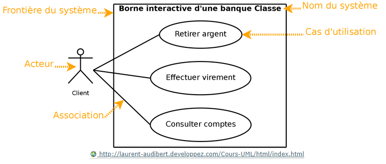

# UML 

## Diagramme Use Case 

### Définition 

Il permet d'identifier les possibilités d'interaction entre le système et les acteurs (intervenants extérieurs au système), c'est-à-dire toutes les fonctionnalités que doit fournir le système. Il permet aussi de délimiter le système.

Lorsqu'on nomme une interaction, il est important de lui donner un verbe à l'infinitif qui décrit l'action. *Exemple : Retirer de l'argent.*

### Exemple - Projet Caisse Automatique 

Description haut niveau (détailler le contenu des uses-case de manière simple)

| Use Case | Acheter Produit  
| :-------------: |:--------------:| 
| Acteur principal | Client | 
| Acteur secondaire | Caissier |

Actions : 
* Le caissier scanne le produit
* Le système lui indique le montant 
* Le client paie
* Le caissier rend la monnaie (si nécessaire)
* La caissier donne le ticket de caisse

| Use Case | Rendre Produit  
| :-------------: |:-------------:| 
| Acteur principal | Client | 
| Acteur secondaire | Caissier |

Actions : 
* Le client amène le produit et le ticket de caisse
* Le caissier vérifie l’état du produit
* Le caissier active sur sa caisse la fonctionnalité de retour
* Le caissier scanne le ticket de caisse et le produit
* Le caissier rembourse le client

## Diagramme de séquence "Boîte noire"

### Définition 

Ce diagramme décrit comment les éléments du systèmes interagissent entre eux et avec les acteurs : 
* Les objets au coeur d'un système interagissent en s'échangeant des messages
* Les acteurs interagissent avec le système au moyen d'IHM (Interfaces Homme-Machine)

Le diagramme de séquence "Boîte Noire" permet de visualiser l'enchaînement des actions dans le  temps. 

Les objets dialoguent à l'aide de message.

### Exemple - Projet Caisse Automatique 

## Diagramme de classes 